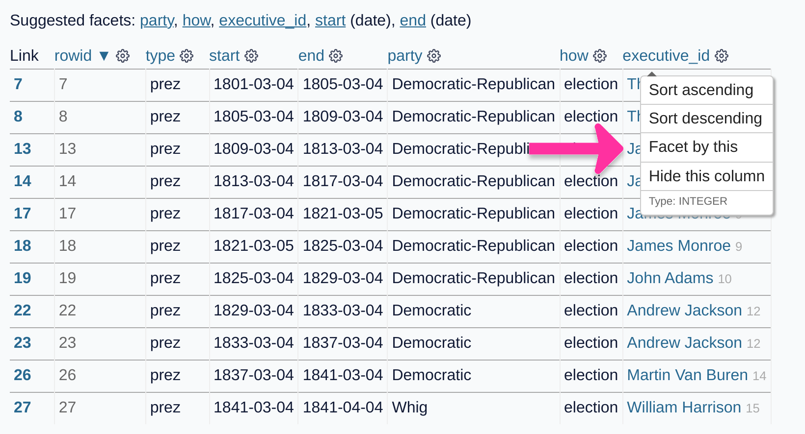

# shot-scraper-demo

Live demo of [shot-scraper](https://github.com/simonw/shot-scraper)

The demo runs [this GitHub Actions workflow](.github/workflows/shots.yml) to generate screenshots using procedures defined using YAML files.

The screenshot images are then written back to this repository.

## Annotated screenshot

This screenshot is generated [from this page](https://congress-legislators.datasettes.com/legislators/executive_terms?start__startswith=18&type=prez
) by [annotated-screenshot.yml](annotated-screenshot.yml), with extra JavaScript to open the menu and add the arrow.

## Recent Owls in El Granada, CA

This image is grabbed from the nine most recently spotted [Owls near El Granada, CA](https://www.owlsnearme.com/?place=127871) by [owlsnearme-el-granada.yml](owlsnearme-el-granada.yml), with JavaScript to remove the "5 hours ago" text.

You can compare previous versions of this image [using this commit history page](https://github.com/simonw/shot-scraper-demo/commits/main/owlsnearme-el-granada.jpg).

